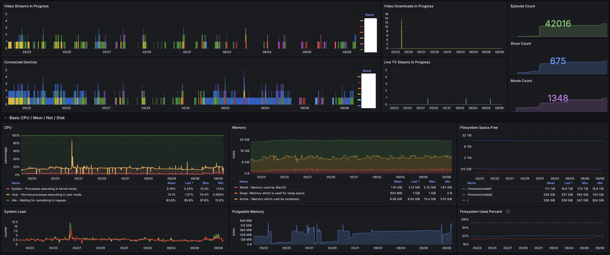
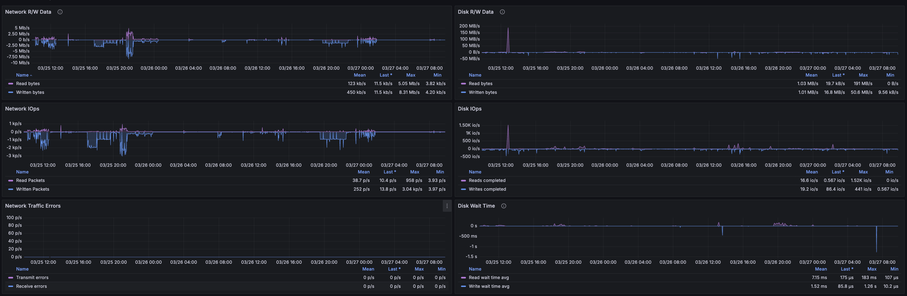

# Hosting Jellyfin on macOS. The Ultimate Guide.

MacOS, especially on ARM-based Mac minis, offers a remarkably powerful and affordable platform for Jellyfin.

ARM Mac minis deliver exceptional transcoding performance thanks to Apple's M series processors and
VideoToolBox hardware encoder. The output of VideoToolBox won't match the quality of software encoders, but I can't tell
the difference without pausing playback and searching for fragments. This is particularly true when watching from outside
my local network.

I initially sourced a base-model M1 Mac mini for just $300, easily handling eight simultaneous live transcode sessions
without issue. After upgrading to an M4 Pro Mac mini, transcoding performance became essentially limitless for practical purposes.

> **Note:** These are live transcode sessions, meaning that ffmpeg is encoding to keep up with realtime playback. A single
> high quality encoding session running with ffmpeg can exhaust the resources of either model. Although notably, when
> I did encode my library I experienced no lag when using Jellyfin to watch content simultaneously. 

Moreover, macOS's native RAID capabilities add robust data security and flexibility. RAID arrays configured on macOS
store volume information directly on the disks, allowing seamless migration between Macs. When I upgraded my Mac mini
from an M1 to an M4, transitioning my media library was as straightforward as plugging the RAID array into the new
machine—no data loss, no hassle.

Why Jellyfin over alternatives like Plex or Emby? Jellyfin is fully free and open-source, respects your privacy, does not
pollute your library with content injections, and officially supports ARM builds for macOS. Crucially, Jellyfin leverages Apple's
VideoToolBox hardware acceleration out-of-the-box. A capability notably absent in Emby, even on paid plans.

When I started this project I found resources for hosting on macOS limited despite the obvious benefits. Almost all
existing resources are limited to getting Jellyfin started and connecting to it via the local network. It took a lot of
trial and error to create a simple configuration that achieved the stability I desired. I wanted to provide a guide to
others, so they could skip the hassle. The goals of this implementation are:

* Cleanly reinitialize the server in the event of a restart.
* Provide valuable metrics and visualizations.
* Ensure the metrics database consumes minimal disk space. 

#### Table of Contents

1. [Setup RAID](#setup-raid-array)
2. [Jellyfin](#install-jellyfin)
3. [Turn off Sleep](#turn-off-sleep)
4. [Remote Connection](#remote-connection)
   - [Port Forwarding](#port-forwarding)
   - [Reverse Proxy](#reverse-proxy)
   - [Custom Domain](#custom-domain)
     * [DNS Record](#dns-record)
     * [Reverse Proxy Updates](#reverse-proxy-updates)
5. [Startup Automation](#startup-automation)
   - [Write Startup Script](#write-startup-script)
     * [Logging](#logging)
     * [Wait for Volumes](#wait-for-volumes)
     * [Start Jellyfin](#start-jellyfin)
     * [Start Caddy](#start-caddy)
   - [Create Launch Agent](#create-launch-agent)
   - [Automatic Log In](#automatic-log-in)
6. [VNC Remote Management](#vnc-remote-management)
7. [Monitoring](#monitoring)
   1. [Enable Jellyfin Metrics](#enable-jellyfin-metrics)
   2. [Extra Metrics](#extra-metrics)
   3. [Install Tools](#install-tools)
   4. [Configure Prometheus](#configure-prometheus)
   5. [Configure Grafana](#configure-grafana)
   6. [Create Dashboard](#create-dashboard)
   7. [Update Startup Script](#update-startup-script)
8. [LiveTV](#livetv)

## Setup RAID Array

> **Note:** If you already have a NAS, RAID array, or other storage solution, feel free to connect that it
> your Mac and skip this section.

To connect hard drives to your Mac, you will need a JBOD (Just a Bunch Of Disks) external drive enclosure. I don't
recommend purchasing an enclosure with RAID capabilities built-in. In that case, if the hardware powering the raid
array fails, your data will be forever lost. Using the software RAID provided by macOS, the drives simply need to be
moved to a new enclosure and any Mac can rebuild the array. 

The enclosures most recommended online are made by OWC and MediaSonic. [These are the OWC enclosures I use for both my arrays.](https://www.amazon.com/dp/B09SC124GS)

If you are looking for hard drive recommendations, I use refurbished drives sold by [goHardDrive](https://www.amazon.com/sp?ie=UTF8&seller=A10GIQVUTYZMGS),
and they've lasted several years of heavy use without issue. Buying large drives at the start will be an investment,
but will reduce the amount of drive enclosures you need to buy. 

MacOS supports RAID 0, 1, and 10 (via building a RAID 0 on top of two RAID 1 arrays). There are only two setups I
recommend, and each comes with their own advantages and disadvantages. 

### RAID 10s

Combining two RAID 1 arrays into a single RAID 10 reduces the number of volumes you need to manage.
This simplifies media organization, as moving files and directories within the same volume is instantaneous and
requires fewer configurations in Jellyfin. If you prefer organizing media this way, larger volumes can be beneficial.
However, the downside is that each RAID 10 array requires four drives upfront. At $150-300 per 10-14 TB drive,
this can be a significant investment.

#### Create a RAID 10 Array

Use [Apple's RAID array documentation](https://support.apple.com/guide/disk-utility/create-a-disk-set-dskua23150fd/mac) to complete the next two steps.

1. Follow the directions for creating a RAID 1 Array twice.
2. Follow the directions again, but for RAID 0 using the previously created two RAID 1 arrays as the source drives. 

### RAID 1s

Using RAID 1 provides the same data resiliency while requiring only two drives per array. Although you will need to update
your libraries when adding a new RAID array, so too many arrays may become inconvenient. If you're placing media into a
single directory and relying on Jellyfin for organization, RAID 1 might be the better option.

#### Create a RAID 1 Array

Use [Apple's RAID array documentation](https://support.apple.com/guide/disk-utility/create-a-disk-set-dskua23150fd/mac) to create a RAID 1 array.

### What about RAID 5/6?

MacOS's Disk Utility does not provide RAID 5/6 capabilities, and I've found no open source solutions that "Just work"
on macOS. The only trustworthy solutions that run on Mac are paid, and require yearly subscription payments. I'd rather
pay more upfront in terms of hard drives to have permanent access to my RAID configuration. 

## Create Folder Structure

The folder structure I recommend for each RAID array is below. The `metadata` only needs to exist on one raid array,
but should be moved off the Mac Mini's storage as the metadata directory can get quite large as your library grows. 

```txt
/Volumes/media0 // Root of the RAID array
  - Jellyfin
    - metadata  // Only needed on one RAID array
    - movies
    - shows
```

## Install Jellyfin

In this step, we will only install Jellyfin and configure libraries. Remote access and SSL will be covered in the next section. 

1. Open the [download page](https://repo.jellyfin.org/?path=/server/macos/latest-stable) for the latest stable version of Jellyfin for macOS.
2. Select your architecture.
3. Download the .dmg file.
4. Open the downloaded dmg file and install the Application per usual.
5. Navigate to `http://localhost:8096` in your browser.
6. Follow the initial setup wizard.
   - [Use this guide](https://jellyfin.org/docs/general/server/libraries/) to add libraries instead of creating them during setup.

## Turn off Sleep

The media server won't be much good if it shuts down when not interacted with. 

1. Open the `Settings` app.
2. Open the `Energy` sections.
3. Enable `Prevent automatic sleeping when the display is off`.

## Remote Connection

A media server that only serves your local network is nice, but not as nice as one that can be used while waiting in
the airport. In this section we will set up everything required to allow remote connections into your server and even
connect a domain. 

### Port Forwarding

You must forward port `80` for cert validation, and `443` to serve media over https. The instructions for this differ
based on your router model. Find your router on [portforward.com](https://portforward.com/router.htm), and forward ports `80` and `443` to your Mac. 

### Reverse Proxy

It is possible to manage a ssl certificate yourself by generating it and enabling https in Jellyfin, but if you want to enable
metric collection later you should route incoming connections via a reverse proxy. Using `caddy` as a reverse proxy
is a great choice as it will generate and rotate your ssl certificate for you. 

1. Open `Terminal`
2. [Install brew](https://docs.brew.sh/Installation) if you have not already. 
3. Install caddy `brew install caddy`.
4. In a location of your choosing, create file called "Caddyfile": `touch > Caddyfile`.
   * I hold most items in a desktop folder called `caddy`. My Mac is only used as a media server, so I don't mind keeping things easy to reach.
5. Open the Caddyfile with the text editor of your choice and enter the content below.
   ```txt
   0.0.0.0 {
   	@metrics {
   		path /metrics*
   	}
   	respond @metrics 403
   
   	reverse_proxy 127.0.0.1:8096
   }
   ```
6. Replace `0.0.0.0` with your public IP address.
7. Run `caddy start --config Caddyfile` in the same directory as your Caddyfile.

You should now be able to connect to your server by entering your public IP address in the server field of the Jellyfin app.

### Custom Domain

Using your IP address works, but a domain name is much easier to remember. Follow this section if you've purchased a
domain to link to your media server.

#### DNS Record

Only a single DNS `A Record` needs to be created to direct your hostname to your home IP address. This will differ based
on your DNS provider. I use Digital Ocean for a handful of things, so I manage my domain there too. In the Digital
Ocean Control Panel the result looks like this:


#### Reverse Proxy Updates

Replace the IP address in your Caddyfile with your domain name:

```txt
example.com {
   @metrics {
      path /metrics*
   }
   respond @metrics 403

   reverse_proxy 127.0.0.1:8096
}
```

## Startup Automation

By default, jellyfin and caddy won't perform a clean restart on their own. In this section we will write a LaunchScript
to make sure everything starts in order. 

### Write Startup Script

Open the `Script Editor` application and create a new apple script.

#### Logging

Writing the log to an easy-to-reach location is convenient when something goes wrong, so I write it to a `caddy` folder
on my desktop that contains this start up script and my Caddyfile. To do this yourself, start the script with these two
lines and adjust the file path to your needs.

```applescript
-- Update the file path to that of your choosing
set logFile to open for access POSIX file "/Users/mediaserver/Desktop/caddy/StartupLog.log" with write permission
-- An example of how to write to the log file.
write "Performing start up." & return to logFile
```

The log file must be closed, so at the bottom of your script add the following.

```applescript
close access logFile
```

#### Wait for Volumes

Jellyfin will fail to start if any of the directories used in the media libraries cant be accessed, and the RAID utility
takes 10-30 seconds to make volumes available. To prevent an early launch add this function to your script that
waits until a provided directory is ready before continuing.

```applescript
on waitForVolume(volumePath, logFile)
	repeat
		set volumeExists to do shell script ("if [ -d " & quoted form of volumePath & " ]; then echo 'exists'; else echo 'no'; fi")
		if volumeExists is "exists" then
			exit repeat
		else
			write "Waiting for volume " & volumePath & " to mount." & return to logFile
			delay 2
		end if
	end repeat
	write "Volume " & volumePath & " is now mounted." & return to logFile
end waitForVolume
```

Then call that function as many times as you need providing the volume paths.

```
-- Check that the required volumes exist
waitForVolume("/Volumes/media0", logFile)
waitForVolume("/Volumes/media1", logFile)
```

#### Start Jellyfin

Now Jellyfin can be launched using the code below. 

```applescript
-- Launch Jellyfin
tell application "Finder"
	open application file "Jellyfin.app" of folder "Applications" of startup disk
end tell
write "Jellyfin Launched." & return to logFile
delay 1
```

#### Start Caddy

If you have implemented Caddy as your reverse proxy, that can now be started. In this block of code I launch a terminal
to nohup launch caddy. This is required for the caddy process to be properly disconnected from the script's ownership.
For some odd reason, `do shell script "/opt/homebrew/bin/caddy run --config CaddyFile"` **is not sufficient** and will
result in caddy exiting when the startup script terminates. Launching a terminal to run the nohup command gets around this issue. 

```applescript
-- Command to start Caddy with the specified CaddyFile
write "Starting Caddy server." & return to logFile
tell application "Terminal"
	do script "nohup /opt/homebrew/bin/caddy run --config /Users/mediaserver/Desktop/caddy/CaddyFile > /dev/null 2>&1 &"
	delay 3
	quit
end tell
```

Save this script in a place you will remember. I store mine along with my Caddyfile. You can view the [full script here](./startup-script-basic).

## Create Launch Agent

A launch agent is needed to execute the startup script. 

1. Launch `Terminal`.
2. Enter `cd ~/Library/LaunchAgents` to navigate to your launch agents.
   * If the `LaunchAgents` directory does not exist in `Library`, create and enter it with `mkdir LaunchAgents && cd LaunchAgents`.
3. Create a new file for the launch agent with `touch jellyfin.launch.plist`
4. Open the file with the text editor of your choosing and enter the contents below making sure to edit the startup
   script file path to the location you saved your script.
   ```xml
   <?xml version="1.0" encoding="UTF-8"?>
   <!DOCTYPE plist PUBLIC "-//Apple Computer//DTD PLIST 1.0//EN" "http://www.apple.com/DTDs/PropertyList-1.0.dtd">
   <plist version="1.0">
   <dict>
       <key>Label</key>
       <string>xyz.harperplus.launch</string>
       <key>RunAtLoad</key>
       <true/>
       <key>KeepAlive</key>
       <false/>
       <key>ProgramArguments</key>
       <array>
           <string>/usr/bin/osascript</string>
           <string>/Users/mediaserver/Desktop/caddy/Startup.scpt</string>
       </array>
   </dict>
   </plist>
   ```
   The reference to `osascript` is required in the array. This is the Apple application that executes apple script files. 
5. To test the new launch agent run `launchctl load jellyfin.launch.plist`. On the first run, `osascript` may require
   permissions, approve them.

## Automatic Log In

One of the negatives of hosting a media server on Mac is that volumes are not mounted and applications can't be loaded
before someone logs in. The launch agent created in the previous section won't run until login. We can enable automatic
login to handle restarts completely. This can't be done if FileVault is enabled. 

> **Note:** This will only log in the user **locally**, so remote access enabled in the next section will still require
> authentication. This is a guide for hosting at home. If a bad actor is in your house, then you have issues more
> pressing than your home movie collection. 

1. Open `Settings`.
2. Open `Users & Groups`.
3. Click the users list drop down next to `Automatically log in as` and select your user.
4. Enter the password used for login.

The server may now restart and have Jellyfin and Caddy elegantly resume operation. 

# VNC Remote Management

Remotely controlling the media server with another mac is easy by enabling screen share.

1. First follow [Apples documentation for enabling screen share.](https://support.apple.com/guide/mac-help/turn-screen-sharing-on-or-off-mh11848/mac)
2. Open `Terminal` and run one of the following commands to find the servers IP address on your local network.
   - `ipconfig getifaddr en1` - For wireless connections.
   - `ipconfig getifaddr en0` - For Ethernet connections.
3. From another mac, open a web browser and navigate to `vnc://LOCAL_IP_ADDRESS`.
4. Navigate the menu and login with the user you enabled for screen control.

You will be controlling the screen of the automatically logged-in user.

#### Controlling The Server Outside Your Local Network

You can port forward ports `5900-5902` on your router to enable VNC access outside your local network, but I don't
recommend opening services unless you absolutely require it. This can be done for a short
time if you need to enable access while you are on an extended stay outside your home. 

# Monitoring

Monitoring a personal project is fun. In this section we will set up monitoring services that will use minimal resources
while providing long term metrics and dashboard displays for:

* Active Streams by User
* Active Devices by User
* In progress downloads
* Media count
* LiveTV Streams
* CPU
* Memory
* Network
* Storage
* Uptime

##### Screenshots

_Usernames cleared out for privacy_




## Enable Jellyfin Metrics

The `/metrics` endpoint can't be enabled in the Jellyfin UI. The `system.xml` file must be edited manually.

1. Open `~/Library/Application Support/jellyfin/config/system.xml` with the text editor of your choice.
2. Find the `<EnableMetrics>false</EnableMetrics>` line and change `false` to `true`.
3. Save the file.
4. Restart Jellyfin.

## Extra Metrics

The current metrics provided directly by Jellyfin are poor and some are bugged, so only a handful will be kept to be used
in the Dashboard. There is an [issue open for Jellyfin](https://github.com/jellyfin/jellyfin/issues/3016) to improve
metrics, but there has been no activity in some time. To get around this, I built a minimal api to get the metrics
required from the Jellyfin API. Other solutions for this exist, but many of them have excessive cardinality in metric
labels which will balloon the size of your Prometheus data directory.

If you want your dashboard to show media library size, connected clients, and active streams then install my
[jelly-metrics](https://github.com/Digital-Shane/jelly-metrics) api.

1. Navigate to the releases page for jelly-metrics and download the tar file for your Mac's architecture.
2. Extract the executable from the tar file and store it along with your Caddyfile.
3. Run jelly-metrics via the terminal. If Mac blocks it opening fix that by following these steps.
   1. Open `Settings`
   2. Open the `Privacy & Security` settings
   3. Scroll to the bottom, and click `Allow Anyway`
   4. Run jelly-metrics via the terminal again, and click `Open Anyway`
4. Open your Jellyfin UI, click the hamburger icon in the upper left corner, and open the Administration Dashboard.
5. Scroll down on the left side menu, and select `API Keys`
6. Click the `+` icon, enter `metrics` for the app name, and click `ok`.
7. Update the launch agent to contain your api key by adding the `EnvironmentVariables` key and dict like below. Make sure
   to replace the string `REPLACE-WITH-YOUR-API-KEY` with the API key you just generated. 
   ```xml
   <?xml version="1.0" encoding="UTF-8"?>
   <!DOCTYPE plist PUBLIC "-//Apple Computer//DTD PLIST 1.0//EN" "http://www.apple.com/DTDs/PropertyList-1.0.dtd">
   <plist version="1.0">
   <dict>
        <key>EnvironmentVariables</key>
        <dict>
            <key>JELLYFIN_TOKEN</key>
            <string>REPLACE-WITH-YOUR-API-KEY</string>
       </dict>
       <key>Label</key>
       <string>xyz.harperplus.launch</string>
       <key>RunAtLoad</key>
       <true/>
       <key>KeepAlive</key>
       <false/>
       <key>ProgramArguments</key>
       <array>
           <string>/usr/bin/osascript</string>
           <string>/Users/mediaserver/Desktop/caddy/Startup.scpt</string>
       </array>
   </dict>
   </plist>
   ```
8. We will update the startup script at the end when adding all new monitoring tools. 

## Install Tools

The remaining tools may be installed via brew. Run the following in `Terminal`.

```shell
# Exports CPU, Memory, and Network Interface metrics
brew install node_exporter
# Consumes metrics from node_exporter, Jellyfin, and jelly-metrics and stores them in a database
brew install prometheus
# Reads the metrics database to create data visualizations
brew install grafana
```

## Configure Prometheus

Two files must be edited to configure Prometheus.

1. Open `/opt/homebrew/etc/prometheus.args` with the text editor of your choice.
2. Update (or add) `--storage.tsdb.path` to configure the data directory. Offload this directory to a raid array if
   you want to store extended data.
   * I use `/Volumes/media0/prometheus`.
3. Update (or add) `--storage.tsdb.retention.time` to configure the length of time to store metrics.
   * At the end of this guide the data directory should grow by 50 MB every two weeks.
   * I use `5y` for five years of data.
4. Save the file and open `/opt/homebrew/etc/prometheus.yml` next.
5. Replace the config with:
   ```yaml
   global:
   scrape_interval: 30s
   
   scrape_configs:
   - job_name: "node_exporter"
     static_configs:
       - targets: ["localhost:9100"]
     metric_relabel_configs:
       - source_labels: [__name__]
         # Keep only these metrics
         regex: "(node_boot_time_seconds|node_cpu_seconds_total|node_disk_read_bytes_total|node_disk_read_time_seconds_total|node_disk_reads_completed_total|node_disk_write_time_seconds_total|node_disk_writes_completed_total|node_disk_written_bytes_total|node_filesystem_avail_bytes|node_filesystem_size_bytes|node_load1|node_load5|node_load15|node_memory_active_bytes|node_memory_free_bytes|node_memory_inactive_bytes|node_memory_purgeable_bytes|node_memory_swap_total_bytes|node_memory_wired_bytes|node_network_receive_bytes_total|node_network_receive_errs_total|node_network_receive_packets_total|node_network_transmit_bytes_total|node_network_transmit_errs_total|node_network_transmit_packets_total|node_scrape_collector_duration_seconds|node_time_seconds)"
         action: keep
   - job_name: "jellyfin"
     static_configs:
       - targets: ["localhost:8096"]
     metric_relabel_configs:
       - source_labels: [__name__]
         # Keep only these metrics
         regex: "(http_requests_in_progress)"
         action: keep
   - job_name: "jellyfin-metrics" # Remove this job if not using jelly-metrics!
     static_configs:
       - targets: ["localhost:8097"]
   ```
6. After saving the file reload Prometheus with `brew services restart prometheus`.

This configuration will keep only metrics that are used in the later Grafana dashboard to minimize the Prometheus
data directory.

## Configure Grafana

Next connect Grafana to the Prometheus data store.

1. Open a web browser on the mac, and navigate to `http://localhost:3000/`
2. Login with the default credentials. Username: `admin` | Password: `admin`
3. Follow the first time login process to update the admin account's password. 
4. Click the hamburger icon on the left side and navigate to `Connections` > `Data sources`.
5. Click `Add new data source`.
6. Click `Prometheus`.
7. Enter `http://localhost:9090` as the `Prometheus server URL`.
8. Click `Save and test`.

## Create Dashboard

1. Download the [grafana-dashboard.json](/grafana-dashboard.json) file in this repository.
2. Open your Grafana dashboard at `http://localhost:3000/` and login. 
3. Click the hamburger icon on the left side and navigate to `Dashboards`.
4. Click `New` > `Import`.
5. Click `Upload dashboard JSON file`.
6. Select the downloaded `grafana-dashboard.json` file.
7. Click `Import`.

## Update Startup Script

A few updates are required in the startup script to support our monitoring tools.

1. Open the startup script in the `ScriptEditor`.
2. After launching Jellyfin, launch `jelly-metrics` using the same trick as caddy to disown the process. Skip this step
   If you opted to not use jelly metrics.
   ```applescript
   -- Launch the jelly-metrics metrics exporter
   write "Launching Jelly Metrics" & return to logFile
   tell application "Terminal"
    	do script "nohup /Users/mediaserver/Desktop/caddy/jelly-metrics > /dev/null 2>&1 &"
    	delay 3
    	quit
   end tell
   ```
3. Directly after, restart Prometheus now that the data directory on the RAID volume is accessible and all job targets are running.
   ```applescript
   -- Launch Promethous Now that Volumes are mounted and metric sources have started
   write "Restarting Promethous" & return to logFile
   do shell script "/opt/homebrew/bin/brew services restart prometheus"
   delay 1
   ```
4. Save the script.

You can view the [full script with metric handling here](./startup-script-metrics).

# LiveTV

Shout out to [ErsatzTV](https://ersatztv.org/) an IPTV server that lets you create live TV channels from your Jellyfin
content. They release a build for ARM Macs. I highly recommend it once you have built up some content to add a new way
to enjoy your content. Great for when you want to sit down and watch television for 20 minutes, but don't want to commit to
a show you are actively engaged in. 

You can update your startup script to support ErsatzTV by launching the application after Jellyfin

```applescript
-- Launch ErsatzTV
tell application "Finder"
	open application file "ErsatzTV.app" of folder "Applications" of startup disk
end tell
write "ErsatzTV Launched." & return to logFile
delay 1
```

You can view the [full script with metric handling and ErsatzTV here](./startup-script-livetv).
